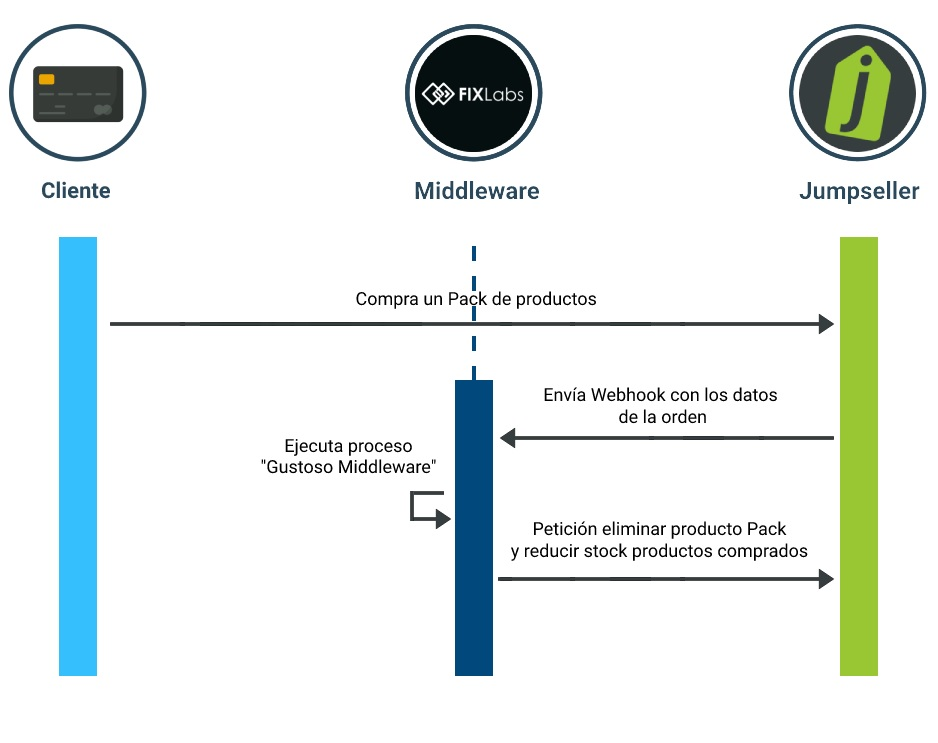
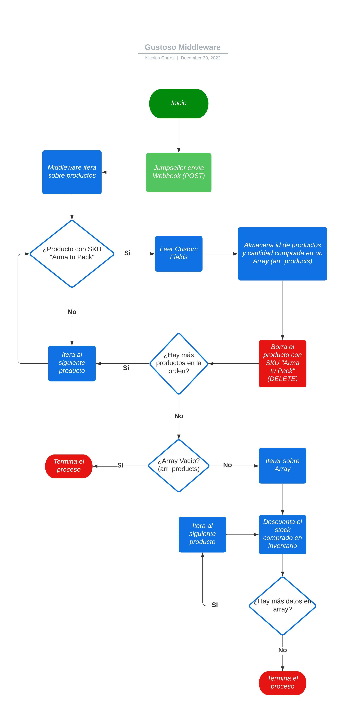

# Gustoso Gourmet API

Este pequeño backend nos ayuda a crear Packs en la plataforma Jumpseller, dado que la plataforma actualmente no nos ofrece algún servicio o plugin con el cual trabajar.

## Lista Endpoints

Todos los Endpoints no requieren autenticación.

* Crear Producto: `POST /api/create_product`
* Webhook: `POST /api/callback_webhook`
* Productos por categoria: `GET /productos/categoria/{category_id}`

Indice
========

- [Crear Producto](#instalación)
    - [Flujo dentro de la API](#aplicación-principal)
    - [Request y response API](#librerías-de-python)
- [Callback Webhook](#archivos-del-proyecto)
    - [Flujo dentro de la API](#módulos)
    - [Diagrama de secuencia](#arbol-de-archivos)
    - [Diagrama Gustoso Middleware](#arbol-de-archivos)
    - [Response Webhook](#arbol-de-archivos)
- [Productos por categoria](#manual-de-uso)
    - [Response Webhook](#arbol-de-archivos)
- [Instrucciones para ENV](#instalación)


# Crear Producto

Para poder gestionar los packs, necesitamos generar un "Producto Pack" a través del meta producto. Este "Producto Pack" es el que el cliente compra y es el que tenemos que procesar dentro de la API.

## Flujo dentro de la API
1. Crear Producto {name, price} 
2. Asignar imagen al producto {image_url}
3. Crear Variaciones con stock y nombres de productos {stock , variants: name}
4. Crear Custom Fields con id de los productos {variants: id}


**URL** : `/api/create_product`

**Method** : `POST`

**Autenticación Requerida** : NO

## Request y response API
**Body constraints**

```json
{
	"name": "string",
	"price": 0,
	"qty": 0,
	"image_url": "string",
	"products": [
	{
		"name": "string",
		"id": 0
	},
    	{
		"name": "string",
		"id": 0
	}
	]
}
```

**Body example**

```json
{
	"name": "Producto Pack definitivo",
	"price": 15990,
	"qty": 3,
	"image_url": "https://cdnx.jumpseller.com/fixlabs-dev/image/29497655/pack_1.jpg?1668693051",
	"products": [
    {
		"name": "Mermelada Vino Merlot",
		"id": 16256992
	}, {
		"name": "Mermelada Pimentón Rojo y Cerveza Negra",
		"id": 16257014
	}, {
		"name": "Mermelada Frambuesa, Cerveza y Merquén",
		"id": 16257037
	}
  ]
}
```


**Success Response**

**Code** : `200 OK`

**Content example**

```json
{
  "product": {
    "id": 0,
    "name": "string",
    "page_title": "string",
    "description": "string",
    "price": 0,
    "discount": 0,
    "weight": 1,
    "stock": 100,
    "stock_unlimited": true,
    "sku": "string",
    "brand": "string",
    "barcode": "string",
    "google_product_category": "string",
    "featured": false,
    "status": "available",
    "created_at": "string",
    "updated_at": "string",
    "package_format": "box",
    "length": 0,
    "width": 0,
    "height": 0,
    "diameter": 0,
    "permalink": "string",
    "categories": [
      {
        "id": 0,
        "name": "string",
        "parent_id": 0,
        "permalink": "string"
      }
    ],
    "images": [
      {
        "id": 0,
        "position": 0,
        "url": "string"
      }
    ],
    "variants": [
      {
        "id": 0,
        "price": 0,
        "sku": "string",
        "barcode": "string",
        "stock": 100,
        "stock_unlimited": true,
        "options": [
          {
            "product_option_id": 0,
            "product_option_value_id": 0,
            "name": "string",
            "option_type": "option",
            "value": "string",
            "custom": "string",
            "product_option_position": 0,
            "product_value_position": 0
          }
        ],
        "image": {
          "id": 0,
          "position": 0,
          "url": "string"
        }
      }
    ]
  }
}
```

# Callback Webhook
Este proceso se desencadena automáticamente desde Jumpseller.

Cuando un usuario compre algun producto (status="paid"), Jumpseller envía una petición con la información de la orden a este Endpoint. Dentro de la orden están los productos, dentro de la API vamos a procesar todos los productos que tengan un SKU = "Arma tu Pack". 

## Flujo dentro de la API
1. Obtiene el array de productos comprados en la orden.
2. Por cada producto verifica si su SKU es "Arma tu Pack" (Si el SKU es distinto, omite ese producto).
3. Se iterará de forma anidada en los custom fields de los productos que cumplan con el SKU. Con esto obtenemos los id de los productos que componen el pack. Se iran almacenando en formato (product_id, stock) dentro de un arreglo (product_array_qty).
4. El producto con SKU "Arma tu Pack" se elimina en esta etapa ya que no es necesario.
5. Se verifica que el largo de este arreglo sea mayor a 0. Caso contrario se termina el proceso (dentro de la ordeno no hubo ningún producto con SKU = "Arma tu Pack").
6. Por cada producto dentro del arreglo mencionado en el punto anterior, se restará el stock actual menos la cantidad comprada en el pack (stock_actual - qty).

## Diagrama de secuencia


## Diagrama Gustoso Middleware



**URL** : `/api/callback_webhook`

**Method** : `POST`

**Autenticación Requerida** : NO

## Response Webhook

**Body Example (Generado por Jumpseller)**

```json
{
  "order": {
    "id": 0,
    "created_at": "string",
    "status": "Paid",
    "status_enum": "abandoned",
    "currency": "string",
    "subtotal": 0,
    "tax": 0,
    "shipping_tax": 0,
    "shipping": 0,
    "shipping_required": true,
    "shipping_option": "delivery",
    "same_day_delivery": false,
    "total": 0,
    "discount": 0,
    "shipping_discount": 0,
    "payment_method_name": "string",
    "payment_method_type": "string",
    "shipping_method_id": 0,
    "shipping_method_name": "string",
    "external_shipping_rate_id": "string",
    "payment_information": "string",
    "additional_information": "string",
    "duplicate_url": "string",
    "recovery_url": "string",
    "checkout_url": "string",
    "coupons": "string",
    "customer": {
      "customer": {
        "id": 0,
        "email": "string",
        "phone": "string",
        "fullname": "string",
        "status": "approved",
        "accepts_marketing": false,
        "accepted_marketing_at": "string",
        "cancelled_marketing_at": "string",
        "shipping_address": {
          "name": "string",
          "surname": "string",
          "address": "string",
          "city": "string",
          "postal": "string",
          "municipality": "string",
          "region": "string",
          "country": "string"
        },
        "billing_address": {
          "name": "string",
          "surname": "string",
          "taxid": "string",
          "address": "string",
          "city": "string",
          "postal": "string",
          "municipality": "string",
          "region": "string",
          "country": "string"
        },
        "customer_categories": [
          {
            "customer_category": {
              "id": 0,
              "name": "string",
              "code": "string"
            }
          }
        ],
        "customer_additional_fields": [
          {
            "customer_additional_field": {
              "id": 0,
              "label": "string",
              "value": "string",
              "area": "string",
              "customer_id": 0,
              "checkout_custom_field_id": 0
            }
          }
        ]
      }
    },
    "shipping_address": {
      "name": "string",
      "surname": "string",
      "address": "string",
      "city": "string",
      "postal": "string",
      "municipality": "string",
      "region": "string",
      "country": "string",
      "country_name": "string",
      "street_number": 0,
      "complement": "string",
      "latitude": 0,
      "longitude": 0
    },
    "billing_address": {
      "name": "string",
      "surname": "string",
      "address": "string",
      "city": "string",
      "postal": "string",
      "municipality": "string",
      "region": "string",
      "country": "string",
      "country_name": "string",
      "street_number": 0,
      "complement": "string"
    },
    "products": [
      {
        "id": 0,
        "variant_id": 0,
        "sku": "string",
        "name": "string",
        "image": "string",
        "qty": 0,
        "price": 0,
        "discount": 0,
        "weight": 1,
        "taxes": [
          {
            "id": 0,
            "name": "string",
            "rate": 0,
            "fixed": false,
            "tax_on_product_price": false
          }
        ]
      }
    ],
    "tracking_number": "string",
    "tracking_company": "string",
    "tracking_url": "string",
    "shipment_status": "Delivered",
    "shipment_status_enum": "delivered",
    "shipping_taxes": [
      {
        "id": 0,
        "name": "string",
        "country": "string",
        "region": "string",
        "rate": 0,
        "fixed": false,
        "tax_on_shipping_price": false
      }
    ],
    "source": {
      "source_name": "string",
      "medium": "string",
      "campaign": "string",
      "referral_url": "string",
      "referral_code": "string",
      "user_agent": "string",
      "first_page_visited": "string",
      "first_page_visited_at": "string",
      "referral_source": "string"
    },
    "additional_fields": [
      {
        "label": "string",
        "value": "string"
      }
    ]
  }
}
```
# Productos por categoria

Este endpoint retorna todos los productos que pertenezcan a una determinada categoría. El id de la categoría debe ser ingresado en la url de la petición reemplazando a {category_id}.

Como respuesta el Endpoint retorna un Array Json con todos los productos que pertenecen a esa categoría.

**URL** : `/api/productos/categoria/{category_id}`

**Method** : `GET`

**Autenticación Requerida** : NO

**Body Request** : VACIO

## Response API

**Body Response**
```json
[
  {
    "product": {
      "id": 0,
      "name": "string",
      "page_title": "string",
      "description": "string",
      "price": 0,
      "discount": 0,
      "weight": 1,
      "stock": 100,
      "stock_unlimited": true,
      "sku": "string",
      "brand": "string",
      "barcode": "string",
      "google_product_category": "string",
      "featured": false,
      "status": "available",
      "created_at": "string",
      "updated_at": "string",
      "package_format": "box",
      "length": 0,
      "width": 0,
      "height": 0,
      "diameter": 0,
      "permalink": "string",
      "categories": [
        {
          "id": 0,
          "name": "string",
          "parent_id": 0,
          "permalink": "string"
        }
      ],
      "images": [
        {
          "id": 0,
          "position": 0,
          "url": "string"
        }
      ],
      "variants": [
        {
          "id": 0,
          "price": 0,
          "sku": "string",
          "barcode": "string",
          "stock": 100,
          "stock_unlimited": true,
          "options": [
            {
              "product_option_id": 0,
              "product_option_value_id": 0,
              "name": "string",
              "option_type": "option",
              "value": "string",
              "custom": "string",
              "product_option_position": 0,
              "product_value_position": 0
            }
          ],
          "image": {
            "id": 0,
            "position": 0,
            "url": "string"
          }
        }
      ]
    }
  }
]
```

# Instrucciones para ENV

1. Realizar una copia del archivo .env.example y renombrarlo a .env
2. Vamos hasta el final donde tenemos 2 variables las cuales no tienen valor asignado.
    1. `API_LOGIN` : Token Login entregado por Tienda Jumpseller.
    2. `API_AUTH_TOKEN`: Token AuthLogin entregado por Tienda Jumpseller.
3. Una vez reemplazados los valores el proyecto puede ser ejecutado correctamente.